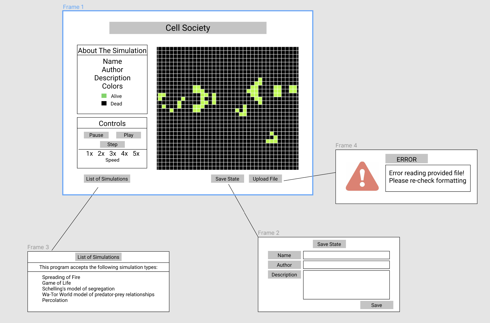

# Cell Society Design Plan
### 9
### Robert Cranston, Eric Xie, & Thivya Sivarajah

## Introduction
We are trying to create a program that can read multiple different XML files and handle different types of cell automaton simulation. The primary design goals are to create a base cell automaton simulation that can handle various different states so that adding another class with different rules on how cells will grow is simple and quick. It is relatively easy to extend upon the Grid class and Cell class (we have done exactly that in the Overview). But, the specifics on creating the animation, updating the animation, and reading the XML are all closed for modifications. 

## Design Overview
Map of Design: [Overview](./images/basicLayoutCell.png)

## Design Details

The first component we have (at the top and center of the Overview) is our animation class. This essentially has our entire user interface and allows us to get the animation. Additionally, we have the speed at which we want the animation to update, as these simulations change over time. Finally, we have parameters (animationWidth and animationHeight) to determine the simulation size and the createAnimation method to create our animation. Used within the animation class to create the grid portion of our display is the Grid class. The grid class contains all the parameters necessary to make the grid, including the width, height, speed of growth of the cells, and the 2D array containing cell objects. We also have functions to update the grid and to read the XML files. Our two file types that we are exploring using are XML and text and for the grid, we could either use a map or a 2D array. The cell class has all the information regarding the cell. Specifically, it's status of being "on" or "off", what the status of the neighbors is, and also, roughly what type of simulation we are dealing with. The rules for what a neighbor is in the simulation change (whether they include the diagonal cells or not), so we included a check for that as well. Among the grid class, we have our five simulations that we intend to create. The csPercolation class is unique in that it utilizes the Percolation algorithm. The paper given to use also suggested the use of a linkedlist data structure for this simulation, so that suggestion is noted in the overview. For the schellingSegregation class, we have all the information about the agents, including whether a cell has an agent, whether the agent is satisfied, how many like-neighbors it takes for the agent to be satisfied, and the status of the neighbors around the agent (whether they are like cells or not). All the methods correspond to the information stated above, with addition of the relocateAgents method to relocate unsatisfied agents (not that in this case, an agent is a cell). For the spreadingFire class, we have the probability a tree will catch on fire if its neighbors are on fire and if the cell is a viable tree. We have the suggested method from the reading of applySpread() to apply the random function and the function to change state (fire()). For the gameOfLife simulation, we have a boolean to determine if a cell is alive (along with a function to check) and we have two functions to change the state from alive to dead or dead to alive respectively. Finally, we have the watorWorld class, where we have a boolean to see if there is fish. We have functions to randomly select movement for our objects in question, functions to make the fish and shark move respectively, a function to change the state of a cell, and a function where the shark eats a fish. We determined that it would also be beneficial to have a Fish and a Shark class that build off of the Cell class to go along with the watorWorld simulation. The fish has its own fixed time needed to reproduce and the time it has left until it can reproduce. The functions that go along with these variables are the function to reproduce fish and the function to track time (trackChronons()). The shark class builds off of the fish class by having two variables for initial energy and current energy, as well as a function to change energy to see if the shark should still be alive. We could easily create more classes that build off the Cell class for other simulations should we want to add on to our code. Furthermore, the flexibility in adding a simulation is as easy as adding a new class with a few changes in specific rules (for example, we made sure that we could have more than two states for a cell so we could work with more simulations than just "alive" and "dead" simulations).  

## Use Cases

* Apply the rules to a middle cell: set the next state of a cell to dead by counting its number of neighbors using the Game of Life rules for a cell in the middle (i.e., with all its neighbors)

 ```java

  // assuming cell is somewhere in the middle of grid
  
    cell.checkNeighborStatus()
  
  // This object method in the Cell class but used in the mechanics class checks the 
  // # of alive neighbor cells and based on that number sets its own instance variable to alive or dead
  // In this case, it would set the instance isOff to true
  
    if(neighborStatus <= 1){
      ifOff = true;
    }


 ```

* Apply the rules to an edge cell: set the next state of a cell to live by counting its number of neighbors using the Game of Life rules for a cell on the edge (i.e., with some of its neighbors missing)

 ```java

cell.checkNeighborStatusNoDiag()

// Similar to before, this object method in Cell class checks # of alive neighbor cells
// and does not include the missing diagonal cell

if(neighborStatusNoDiag > 2){
  isOff = false;
}


 ```

* Move to the next generation: update all cells in a simulation from their current state to their next state and display the result graphically

 ```java

// assuming grid 2d array object has been created and filled with cells

public void step(){
    myGrid.gridUpdate();
    myDisplay.display(myGrid);
}

// after all cells been checked in a step, update the grid (move into the next
// generation) and refresh the UI/display to show the new grid


 ```

* Switch simulations: load a new simulation from a data file, replacing the current running simulation with the newly loaded one


 ```java

// the readXML() grid takes the XML file and takes the data including simulation and
// the width and the height of the grid, which is then used in setUpGrid() to create
// a grid of simulation type

if(updateFilePressed){
  
  File config = uploaded_file.xml;
  GridClass grid = newGridClass();
  grid.readXML(config);
  
}

 ```

* Set a simulation parameter: set the value of a parameter, probCatch, for a simulation, Fire, based on the value given in a data file

```java

// setUpGrid() method of the spreadingFire() class takes the value from the .readXML
// after the file has been parsed

GridClass myGrid = new GridClass();
        myGrid.readXML(config);

// below is in the readXML file

if(grid.variation.toLowerCase.equals("spreading fire")){
grid = new spreadingFire();
probCatch = config.catchFireConstant;
}
        
```

* Initialize Grid from read xml to its given size

 ```java
 GridClass grid=new GridClass();
    grid.readXML(newXML);
    grid.gridSetUp();
 ```

* Initialize each cell with its initial state

```java
for(List row:myGrid){
    for(Cell cell:row){
    cell.createState(initialState);
    }
}
```

* initialize a schelling segregation model:

```java
GridClass grid=new GridClass();
grid.readXML();
if(grid.variation.toLowerCase.equals("schelling segregation")){
  grid=new SchellingSegregation();
}
```

* initialize and update the grid for a schelling segregation model:

```java
grid.createGrid();
for(List row:myGrid){
  for(Cell cell:row){
    if(!isAgentSatisfied(cell)){
      relocateAgents(cell);
    }
  }
}
```

* Determine whether to end the animation in a schelling segregation model:

```java
AnimationClass animation=new AnimationClass();
animation.createAnimation();
if(grid.allAgentsHappy()){
  animation.setPhaseSpeed(0);
}
```

* In WatorWorld: update position for fish:

```java
watorWorlds watorGrid=new WatorWorld();
//in watorGrid
for(List row:myGrid){
  for(Cell cell:row){
    if(getTimeLeftReproduce==0){
      reproduceFish();
    }
    else{
      trackChronons
    }
  }
}
```

## Design Considerations

#### Design Issue #1

One design decision that we discussed was over how to check the neighbors of a cell and determine
its next state

* Current Idea 
    * The current idea that we went with is to for its cell to simply keep track of their own state
      and to have the grid itself check all of a cell's neighbors and assing the next state back to
      the original cell. We decided this because it means that cells do not have to have access to
      any of the neighboring cells and can be isolated units.

* Alternative #1
    * The alternative that we decided not to do was to have each check their neighbors' states and
      determine their own next state. The positive of this is that each cell would be completely in
      control of changing their state but the negatives are having to give a cell access to all of
      its neighbors instead of the grid simply just having access to all the cells.

#### Design Issue #2

A by-product of the conversation above was a conversation on where to use inheritance for the 
specific rules
* Current Idea 
  * The current idea is to have one generic grid class and a separate class for each simulation that 
  has all the specific rules for how to update a cell based on its neighbors. This ended up being
  better in our opinion because it makes it easier to include separate instance variables for each 
  simulation that are needed for logic specific to the simulation.
* Alternative #1
  * The alternative idea was to have a generic cell class and to have specific cell classes for each 
  simulation that extended the cell class. Then each cell would contain the rules that they need to 
  determine what their next state should be.
## User Interface

Here is our amazing UI:



Designed in Figma

We decided to keep our design simple for the most part to highlight the simulation itself. This
design features the simulation grid on the right side of the screen with the information about the
simulation and the controls for the simulation on the left side of the screen. The user can upload a
xml file, start and control the simulation, see a list of all supported simulations, and save the
current state of the simulation. The display also shows possible pop-ups that can be triggered by
the user. These include: a list of the simulations we have implemented, the ability to save the
current state of the simulation and a possible error message that can be displayed if the user
inputs a file formatted incorrectly. These error messages could also be displayed if the save state
input slots are left blank.

## Configuration File Format

Two example simulation files have been added to the resources folder.

## Team Responsibilities

Stuff to work on:

* Superclass Grid split between front end class and logic game mechanic class
* Controlling the speed of the animation (speeding up)
* XML file reading, creation, and error handling
* Logic for different simulations
* Frontend for UI Individual classes for cell, different grid inheritance
* Main class area holding the details, step(), calls from UI and backend


* Team Member #1 - Robert Cranston
    * Primary - XML file reading, creation, and error handling
    * Secondary - Superclass Grid front end

* Team Member #2 - Thivya Sivarajah
    * Primary - Simulation Class Grid - Backend
    * Secondary - Cell classes and interaction

* Team Member #3 - Eric Xie
    * Primary - Simulation Class Grid - Backend
    * Secondary - Basic UI

#### Proposed Schedule

Current Goal by this Friday:
Have the XML file reading and handling, general structure of the classes (Grid and cell) completed.
Complete the logic of the simulation classes and create a basic UI that shows the grid itself

During Saturday and Sunday, debug and test as well as submit

Proposed Schedule:

We agreed that we would meet and work in class and outside of class if necessary on Tuesday and
Thursdays. We would work separately otherwise and ask for help if needed.
